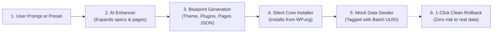
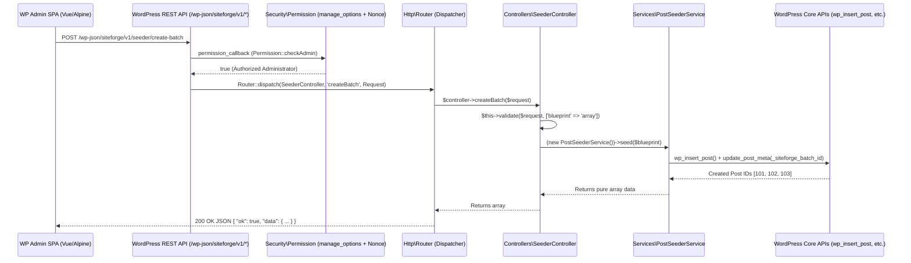
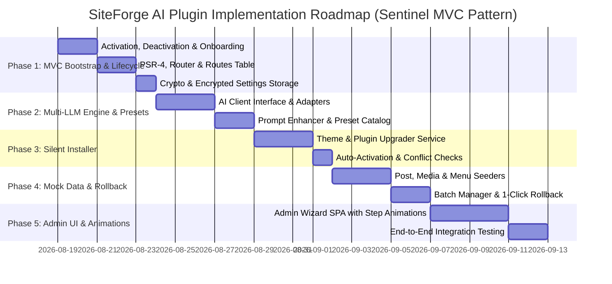

# 🚀 Blueprint & Technical Specification: AI Site Architect Plugin
**Project Codename**: `SiteForge AI` (or `PromptCraft WP`)  
**Architecture**: Strictly aligned with **Sentinel WP MVC Architecture** (PSR-4, Routes Table, Thin Controllers, Domain Services, Security Middleware, Standard Response Envelope)  
**Target Audience**: Developers, Agencies, and Site Builders  
**PHP Version**: `>= 8.1` | **WordPress Version**: `>= 6.2`  

---

## 📋 Table of Contents
1. [Executive Summary & Concept](#1-executive-summary--concept)
2. [Lifecycle Hooks & Pre-Options Engine](#2-lifecycle-hooks--pre-options-engine)
   - [2.1 Activation Hook (`register_activation_hook`)](#21-activation-hook-register_activation_hook)
   - [2.2 Welcome Onboarding & Redirect Flow](#22-welcome-onboarding--redirect-flow)
   - [2.3 Deactivation Hook (`register_deactivation_hook`)](#23-deactivation-hook-register_deactivation_hook)
   - [2.4 Clean Uninstallation Engine (`uninstall.php`)](#24-clean-uninstallation-engine-uninstallphp)
   - [2.5 Quick Starter Presets & Pre-Options](#25-quick-starter-presets--pre-options)
   - [2.6 UI Animation & Progress State Machine](#26-ui-animation--progress-state-machine)
3. [Sentinel-Aligned MVC Architecture](#3-sentinel-aligned-mvc-architecture)
   - [3.1 The Architectural Flow](#31-the-architectural-flow)
   - [3.2 Complete File Tree](#32-complete-file-tree)
4. [Feature Specifications & Domain Services](#4-feature-specifications--domain-services)
   - [4.1 Multi-Model AI Engine (Services\AI\*)](#41-multi-model-ai-engine-servicesai)
   - [4.2 Blueprint & Recommendation Engine (Services\BlueprintService)](#42-blueprint--recommendation-engine-servicesblueprintservice)
   - [4.3 Core Package Installer (Services\InstallerService)](#43-core-package-installer-servicesinstallerservice)
   - [4.4 Mock Data Seeder (Services\MockData\*)](#44-mock-data-seeder-servicesmockdata)
   - [4.5 Safe Tagging & 1-Click Rollback (Services\RollbackService)](#45-safe-tagging--1-click-rollback-servicesrollbackservice)
5. [Routing & Controller Layer](#5-routing--controller-layer)
6. [WordPress Core APIs & Hooks Map](#6-wordpress-core-apis--hooks-map)
7. [Step-by-Step Implementation Roadmap](#7-step-by-step-implementation-roadmap)

---

## 1. Executive Summary & Concept

**SiteForge AI** turns a simple prompt (e.g. *"A luxury Italian restaurant in Paris with online table booking, chef specials menu, reviews, and dark aesthetic"*) into a **fully functioning, beautifully styled WordPress website** with themes, plugins, pages, Gutenberg blocks, and mock data in under 60 seconds.



---

## 2. Lifecycle Hooks & Pre-Options Engine

### 2.1 Activation Hook (`register_activation_hook`)
When an administrator activates the plugin, `Plugin::activate()` runs:
1. **Environment & Compatibility Check**:
   * Asserts `PHP_VERSION >= 8.1` (aborts with `wp_die()` if incompatible).
   * Verifies required PHP extensions: `curl`, `openssl`, `json`, `mbstring`.
2. **Pre-Options & Cryptographic Salt Seeding**:
   * Seeds default plugin configuration in `wp_options` under `siteforge_settings` (default AI model: `gpt-4o-mini`, temperature: `0.7`).
   * Generates a local 256-bit encryption key (`siteforge_encryption_key`) for securing API keys.
   * Initializes the empty batch registry: `siteforge_batches = []`.
3. **Onboarding Transient Flag**:
   * Sets a 30-second transient `set_transient( 'siteforge_just_activated', 1, 30 )`.

```php
// siteforge-ai.php
register_activation_hook( __FILE__, array( '\SiteForge\Plugin', 'activate' ) );
```

---

### 2.2 Welcome Onboarding & Redirect Flow
On the very first page load after activation, WordPress Core fires `admin_init`. We intercept this to guide the user seamlessly to the Setup Wizard:

```php
// src/Plugin.php
add_action( 'admin_init', array( '\SiteForge\Admin\Onboarding', 'redirectOnActivation' ) );

// src/Admin/Onboarding.php
public static function redirectOnActivation() {
    if ( get_transient( 'siteforge_just_activated' ) ) {
        delete_transient( 'siteforge_just_activated' );
        if ( ! isset( $_GET['activate-multi'] ) && current_user_can( 'manage_options' ) ) {
            wp_safe_redirect( admin_url( 'admin.php?page=siteforge-wizard&welcome=1' ) );
            exit;
        }
    }
}
```

---

### 2.3 Deactivation Hook (`register_deactivation_hook`)
When deactivated, `Plugin::deactivate()` runs:
* **Safe State Guarantee**: Keeps all user API keys, blueprints, and created mock batches intact.
* **Transient & Cache Purge**: Flushes all temporary generation locks and preview transients (`_transient_siteforge_*`).
* **Cron Cleanup**: Unregisters any background retry crons (`wp_clear_scheduled_hook('siteforge_async_worker')`).

```php
// siteforge-ai.php
register_deactivation_hook( __FILE__, array( '\SiteForge\Plugin', 'deactivate' ) );
```

---

### 2.4 Clean Uninstallation Engine (`uninstall.php`)
Triggered **only** when the user clicks **Delete** from the Plugins table. Follows WordPress strict uninstallation security standards:

```php
<?php
// uninstall.php
if ( ! defined( 'WP_UNINSTALL_PLUGIN' ) ) {
    exit;
}

// 1. Check user preference: "Auto-purge mock batches on plugin uninstall?"
$settings = get_option( 'siteforge_settings', array() );
$purge_mock = ! empty( $settings['purge_mock_on_uninstall'] );

if ( $purge_mock ) {
    require_once plugin_dir_path( __FILE__ ) . 'src/Support/Autoloader.php';
    \SiteForge\Support\Autoloader::register();
    \SiteForge\Services\MockData\BatchManager::purgeAllBatches();
}

// 2. Delete all options & transients created by SiteForge
delete_option( 'siteforge_settings' );
delete_option( 'siteforge_batches' );
delete_option( 'siteforge_encryption_key' );
delete_option( 'siteforge_api_keys' );

global $wpdb;
$wpdb->query( "DELETE FROM {$wpdb->options} WHERE option_name LIKE '_transient_siteforge_%'" );
```

---

### 2.5 Quick Starter Presets & Pre-Options
To allow instant testing without typing a prompt, the plugin includes pre-configured, curated starter presets:

| Preset Niche | Preset Prompt Summary | Recommended Theme | Essential Plugins |
| :--- | :--- | :--- | :--- |
| **🍕 Italian Restaurant** | Elegant pizzeria & wine bar with online table reservation, daily menu showcase, and customer reviews. | `astra` | `wpforms-lite`, `restaurant-reservations` |
| **🛍️ Modern E-Commerce** | Minimalist fashion brand with product collections, size guide, filter by color, and cart drawer. | `oceanwp` | `woocommerce`, `woo-smart-wishlist` |
| **💼 SaaS Tech Startup** | B2B AI analytics platform with pricing tiers, feature comparison grid, testimonial slider, and contact demo form. | `kadence` | `wpforms-lite`, `kadence-blocks` |
| **🩺 Medical & Dental Clinic** | Modern dental practice with online appointment booking, doctor profiles, service cards, and patient reviews. | `neve` | `wpforms-lite`, `easy-appointments` |
| **🏡 Real Estate Agency** | Luxury property listings with interactive neighborhood map, agent profiles, mortgage calculator, and inquiry form. | `astra` | `wpforms-lite`, `essential-blocks` |

---

### 2.6 UI Animation & Progress State Machine
The Admin SPA features a sleek **5-Step Animated State Machine** with live status pulses, micro-interactions, and visual feedback:

```text
[ Step 1: Prompt Input / Preset Select ]
                │ (Click "Generate Site")
                ▼
[ Step 2: ✨ AI Enhancer Animation ] ──► Pulsing glow & expanding prompt diff
                │
                ▼
[ Step 3: 📦 Silent Package Installer ] ──► Live progress checklist (Theme ✔, Plugins ✔)
                │
                ▼
[ Step 4: 🌱 Mock Data Seeder ] ──► Progress bar (Pages, Menus, Stock Photos)
                │
                ▼
[ Step 5: 🎉 Celebration & Preview Bar ] ──► Confetti burst + "View Live Site" + "1-Click Rollback"
```

---

## 3. Sentinel-Aligned MVC Architecture

Just like **Sentinel WP**, the plugin strictly enforces **Separation of Concerns**:
* **`config/routes.php`**: Declarative route table (HTTP method, URL, Controller, Action, Permission).
* **`Http/Router.php`**: Ingests the route table, registers REST endpoints, dispatches requests, and wraps all outputs in `{ ok: true, data }` or `{ ok: false, error }`.
* **`Controllers/*`**: **Thin Controllers**. Only validate parameters and delegate immediately to Services.
* **`Services/*`**: **Fat Services**. All business logic and WordPress Core API interactions live here. No HTTP knowledge.
* **`Security/*`**: Permission gates, crypto helpers (AES-256 for API keys), rate limiters.
* **`Support/*`**: Zero-dependency PSR-4 Autoloader, Request/Response formatters, Filesystem abstraction.
* **`Validation/*`**: Input validation engine (`Validator::validate()`).

### 3.1 The Architectural Flow



---

### 3.2 Complete File Tree

```text
siteforge-ai/
├── siteforge-ai.php               # Bootstrap (Constants, Autoloader, Activation Hook, Plugin::boot())
├── composer.json                  # PSR-4 Map: "SiteForge\\" -> "src/"
├── uninstall.php                  # Clean database cleanup on delete
│
├── config/
│   ├── routes.php                 # Pure data route table (Exact Sentinel format)
│   ├── presets.php                # Quick starter presets (Restaurant, E-commerce, SaaS, Clinic...)
│   └── ai_models.php              # Available LLM models, endpoints & default prompts
│
├── assets/
│   ├── css/admin.css              # Modern WP Admin Styling (Tailwind-based)
│   └── js/app.js                  # Modern Setup Wizard SPA with animations
│
└── src/
    ├── Plugin.php                 # Master bootstrapper (hooks rest_api_init, admin_menu, admin_init)
    │
    ├── Http/
    │   └── Router.php             # Route registrar, controller dispatcher & error normalizer
    │
    ├── Controllers/
    │   ├── BaseController.php     # Input parsing & validation helpers
    │   ├── AIController.php       # /ai/enhance, /ai/blueprint
    │   ├── InstallerController.php# /installer/install (themes & plugins)
    │   ├── SeederController.php   # /seeder/run (pages, posts, menus, media)
    │   ├── RollbackController.php # /rollback/execute, /rollback/batches
    │   └── SettingsController.php # /settings/keys, /settings/get
    │
    ├── Services/
    │   ├── AI/                    # Multi-provider LLM adapters (OpenAI, Claude, Gemini, Groq)
    │   ├── BlueprintService.php   # Prompt enhancer & JSON blueprint parser
    │   ├── InstallerService.php   # Silent \Plugin_Upgrader & \Theme_Upgrader
    │   ├── MockData/              # PostSeeder, MediaSeeder, MenuSeeder, BatchManager
    │   └── SettingsService.php    # Encrypted API key storage
    │
    ├── Security/
    │   ├── Permission.php         # Admin capability & Nonce checks
    │   └── Crypto.php             # AES-256 key encryption
    │
    ├── Validation/
    │   └── Validator.php          # Request schema validator
    │
    ├── Support/
    │   ├── Autoloader.php         # Zero-dependency PSR-4 autoloader
    │   ├── Request.php            # Request helper
    │   └── Response.php           # Unified JSON Response envelope
    │
    └── Admin/
        ├── Onboarding.php         # Welcome redirect & transient management
        ├── SettingsPage.php       # WP Admin menu & view dispatcher
        └── Views/
            ├── wizard.php         # Main AI Prompt-to-Site Wizard SPA
            └── settings.php       # API Key configuration panel
```

---

## 4. Feature Specifications & Domain Services

### 4.1 Multi-Model AI Engine (`Services\AI\*`)
* **Standard Interface**:
  ```php
  namespace SiteForge\Services\AI;

  interface AIClientInterface {
      public function generate( string $system_prompt, string $user_prompt, array $options = array() ): array|\WP_Error;
  }
  ```
* **Adapters**:
  * `OpenAIService`: Native JSON mode (`response_format: { type: "json_object" }`).
  * `AnthropicService`: Claude messages API with XML/JSON system boundaries.
  * `GeminiService`: Structured JSON generation (`response_mime_type: "application/json"`).
  * `GroqService`: Blazing fast generation via Llama-3.3-70b.
* **Storage**: Keys encrypted via `Crypto::encrypt($key)` and stored in `wp_options`.

---

### 4.2 Blueprint & Recommendation Engine (`Services\BlueprintService`)
* **Prompt Enhancer**: Expands brief inputs into comprehensive design prompts.
* **Blueprint Generator**: Produces a clean JSON blueprint specifying:
  1. Best matching WordPress.org Theme (e.g. `astra`, `neve`, `oceanwp`, `kadence`).
  2. Essential Plugins (e.g. `wpforms-lite`, `woocommerce`, `contact-form-7`).
  3. Site Structure (Site Title, Tagline, Pages hierarchy, Navigation Menu layout).
  4. Design Tokens (Color scheme, typography recommendation).

---

### 4.3 Core Package Installer (`Services\InstallerService`)
* Uses WordPress native Upgraders (mirroring Sentinel WP's `PluginService`):
  * `\Plugin_Upgrader` & `\Theme_Upgrader` with silent `\WP_Ajax_Upgrader_Skin`.
  * Communicates with WordPress.org APIs (`plugins_api()`, `themes_api()`).
  * Activates plugins (`activate_plugin()`) and switches themes (`switch_theme()`).

---

### 4.4 Mock Data Seeder (`Services\MockData\*`)
1. **`PostSeederService`**:
   * Inserts static Home page and standard sub-pages using `wp_insert_post()`.
   * Formats content with native **Gutenberg block markup** (Hero blocks, Feature columns, FAQs, Call-to-action).
   * Sets `show_on_front = 'page'` and `page_on_front = $home_page_id`.
2. **`MediaSeederService`**:
   * Fetches relevant royalty-free photos from Unsplash/Picsum.
   * Downloads and creates Media attachments via `media_sideload_image()` / `wp_insert_attachment()`.
   * Sets featured images on created pages and sample blog posts.
3. **`MenuSeederService`**:
   * Creates a WP Nav Menu (`wp_create_nav_menu()`).
   * Adds created pages as menu items (`wp_update_nav_menu_item()`).
   * Attaches menu to the active theme's primary menu location (`set_theme_mod('nav_menu_locations', ...)`).

---

### 4.5 Safe Tagging & 1-Click Rollback (`Services\MockData\BatchManager`)
**Guaranteed Zero Damage to Real Data**:
* Every generation receives a `batch_uuid` (e.g. `batch_67b4c91a0`).
* Every created post/page is tagged:
  ```php
  update_post_meta( $post_id, '_siteforge_mock_data', '1' );
  update_post_meta( $post_id, '_siteforge_batch_id', $batch_uuid );
  ```
* **Rollback Execution**:
  ```php
  // Deletes ONLY items carrying this batch_uuid:
  // 1. Deletes attachments + files from disk
  wp_delete_attachment( $attachment_id, true );
  // 2. Deletes posts/pages bypassing trash
  wp_delete_post( $post_id, true );
  // 3. Deletes created nav menus
  wp_delete_nav_menu( $menu_id );
  // 4. Restores previous home page option
  update_option( 'page_on_front', $previous_home_id );
  ```

---

## 5. Routing & Controller Layer

### `config/routes.php` (Identical Sentinel Model)

```php
<?php
use SiteForge\Controllers\AIController;
use SiteForge\Controllers\InstallerController;
use SiteForge\Controllers\SeederController;
use SiteForge\Controllers\RollbackController;
use SiteForge\Controllers\SettingsController;
use SiteForge\Security\Permission;

return array(
    // AI Endpoints
    'ai/enhance' => array(
        'methods'    => 'POST',
        'controller' => AIController::class,
        'action'     => 'enhance',
    ),
    'ai/blueprint' => array(
        'methods'    => 'POST',
        'controller' => AIController::class,
        'action'     => 'blueprint',
    ),

    // Core Installer Endpoints
    'installer/install' => array(
        'methods'    => 'POST',
        'controller' => InstallerController::class,
        'action'     => 'install',
    ),

    // Mock Data Seeder Endpoints
    'seeder/run' => array(
        'methods'    => 'POST',
        'controller' => SeederController::class,
        'action'     => 'run',
    ),

    // 1-Click Rollback Endpoints
    'rollback/batches' => array(
        'methods'    => 'GET',
        'controller' => RollbackController::class,
        'action'     => 'listBatches',
    ),
    'rollback/execute' => array(
        'methods'    => 'POST',
        'controller' => RollbackController::class,
        'action'     => 'rollback',
    ),

    // Settings & Presets Endpoints
    'presets/list' => array(
        'methods'    => 'GET',
        'controller' => SettingsController::class,
        'action'     => 'getPresets',
    ),
    'settings/get' => array(
        'methods'    => 'GET',
        'controller' => SettingsController::class,
        'action'     => 'getSettings',
    ),
    'settings/save' => array(
        'methods'    => 'POST',
        'controller' => SettingsController::class,
        'action'     => 'saveSettings',
    ),
);
```

---

## 6. WordPress Core APIs & Hooks Map

| WordPress Core API / Hook | Purpose |
| :--- | :--- |
| `register_activation_hook()` | Checks requirements, seeds pre-options, sets onboarding transient |
| `register_deactivation_hook()` | Flushes transients and clears scheduled tasks safely |
| `add_action( 'admin_init', ... )` | Intercepts activation transient to trigger welcome redirect |
| `add_action( 'rest_api_init', ... )` | Hooks into core to register all REST routes via `Router::register()` |
| `add_action( 'admin_menu', ... )` | Injects the SiteForge AI wizard into WP Admin sidebar |
| `add_action( 'admin_enqueue_scripts', ... )` | Loads the Tailwind & Alpine.js wizard app in WP-Admin |
| `\Plugin_Upgrader` & `\Theme_Upgrader` | Silent remote downloads and installations of plugins/themes |
| `plugins_api()` & `themes_api()` | Queries WordPress.org directory for package download URLs |
| `activate_plugin()` & `switch_theme()` | Turns on the newly installed packages |
| `wp_insert_post()` & `update_post_meta()` | Seeds pages with Gutenberg block markup and batch metadata |
| `wp_create_nav_menu()` & `set_theme_mod()` | Builds navigation menus and binds them to theme header |
| `wp_delete_post()` & `wp_delete_attachment()` | Clean 1-click purge of all tagged mock content |

---

## 7. Step-by-Step Implementation Roadmap


